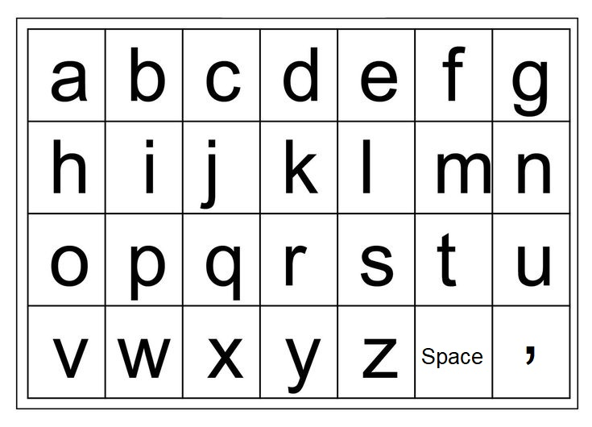

# Grid Keyboard

This project allows users to select characters from a grid using an Arduino and an LCD display. The user navigates through characters using push buttons and confirms their selection.

## Components
- Arduino Uno (or compatible)
- LCD display
- 5 push buttons
- Connecting wires
- Breadboard

## Schematic diagram

## Alphabet grid

## How it Works:
1. The system displays a grid of characters on the LCD screen.
2. Users can navigate through the grid using the push buttons:
- Up/Down buttons move the selection vertically.
- Left/Right buttons move the selection horizontally.
- Confirm button selects the highlighted character and adds it to the output string.
3. The selected characters are displayed on the first row of the LCD screen, while the current selection position (X, Y) is shown on the second row.

## License
This project is open-source and available under the [MIT License](LICENSE).
